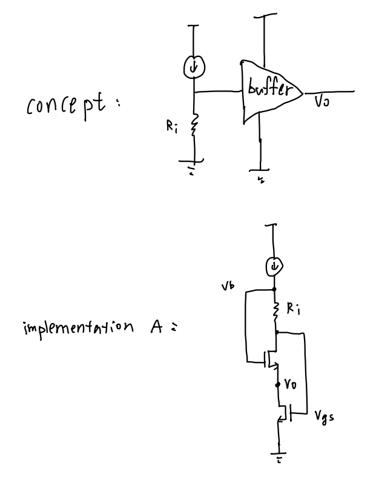
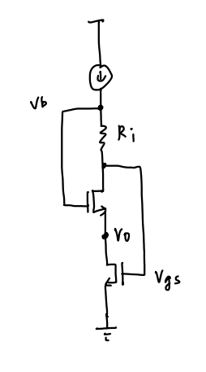
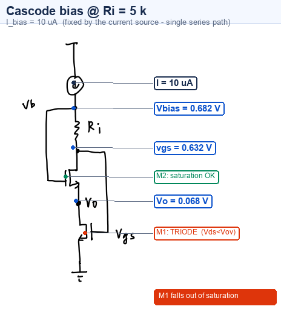
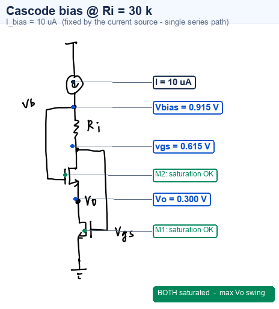
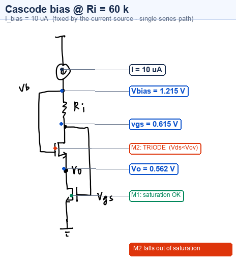
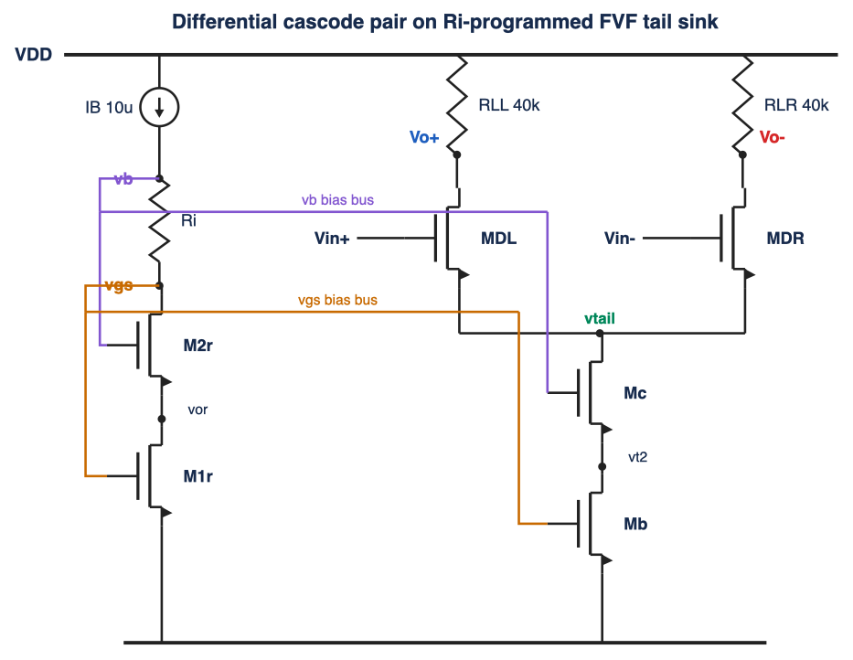
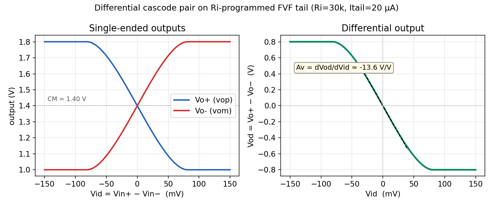

# Cascode Bias Stack — Maximizing Vo Swing with Ri

ngspice simulation of a two-NMOS cascode bias stack. The goal is to choose the
bias resistor **Ri** that maximizes the voltage swing at the internal cascode
node **Vo** while keeping **both** transistors in saturation.

## Concept

<p align="center"></p>
<p align="center"><b>Figure 1.</b> Concept vs implementation — a current source drives Ri into a buffer to set Vo (top); implementation A realizes that buffer as the flipped-voltage-follower (FVF) cascode stack (bottom).</p>

## Hand sketch

<p align="center"></p>
<p align="center"><b>Figure 2.</b> Hand sketch of the FVF cascode bias stack.</p>

## Annotated operating points

The same sketch with the simulated operating point annotated at each node for
three bias resistors. The branch current is a fixed **10 µA** by KCL (single
series path); only the node voltages move.

<p align="center"></p>
<p align="center"><b>Figure 3.</b> Ri = 5 kΩ — Vo sags to 0.068 V, <b>M1 falls into triode</b>.</p>

<p align="center"></p>
<p align="center"><b>Figure 4.</b> Ri = 30 kΩ — Vo centered at 0.300 V, <b>both transistors saturated → maximum Vo swing</b>.</p>

<p align="center"></p>
<p align="center"><b>Figure 5.</b> Ri = 60 kΩ — Vo climbs to 0.562 V, <b>M2 falls into triode</b>.</p>

## Circuit

```
M1 vo  vgs vss vss     ; bottom NMOS   (D=vo, G=vgs, S=gnd)
M2 vgs vb  vo  vo      ; cascode NMOS  (D=vgs, G=vb, S=vo)
Ri vb  vgs             ; sets Vbias = vgs + IB*Ri
Ib vcc vb              ; 10 uA pushed into node vb
```

SPICE MOS order is `D G S B`. The devices form a series stack and the current
source feeds the top of the resistor:

```
        IB (10 uA)
         │
        vb ──[ Ri ]── vgs = M1 gate = M2 drain
         │              │
     M2 gate            M2 (D=vgs, S=vo)
                        │
                        vo  ← internal cascode node (the swing node)
                        │
                        M1 (D=vo, S=gnd)
                        │
                       gnd
```

Because there is a single series path and `Ib` is an ideal current source,
**KCL forces the branch current through Ri, M2 and M1 to equal IB = 10 µA for
every value of Ri.** Ri does *not* set the current — it sets

```
Vbias = V(vb) = V(vgs) + IB·Ri
```

and, since the cascode device holds `Vo = Vb − VGS2`, Ri directly positions the
DC level of **Vo**.

### Simulation setup
- `VDD = 1.8 V`, `IB = 10 µA`
- Level-1 NMOS: `VTO=0.5 KP=150u LAMBDA=0.02 GAMMA=0`, `W/L = 5µ/0.5µ`
- `Vth = 0.5 V` exactly (GAMMA=0, and each bulk tied to its own source → VBS=0)
- Overdrive `Vov ≈ 0.115 V` at 10 µA

## The swing window

`Vo` must stay inside the range where both devices remain saturated:

| bound | condition | value |
|-------|-----------|-------|
| lower edge | `Vo ≥ Vov1` (else **M1 → triode**) | ≈ 0.115 V |
| upper edge | `Vo ≤ V(vgs) − Vov2` (else **M2 → triode**) | ≈ 0.500 V |

In terms of Ri this window is **≈ 12 kΩ … 49 kΩ**. Centering `Vo` in the window
maximizes the *symmetric* swing.

## Operating-point comparison (`cascode_bias.cir`)

| Ri | **Vbias** (vb) | vgs | **Vo** | M1 | M2 | swing dn/up | max sym. swing |
|----|------|------|------|------|------|------|------|
| 5 k | 0.682 | 0.632 | 0.068 | **TRIODE** | sat | −0.065 / +0.450 | 0 |
| 10 k | 0.716 | 0.616 | 0.101 | **TRIODE** | sat | −0.015 / +0.400 | 0 |
| 20 k | 0.815 | 0.615 | 0.200 | sat | sat | +0.085 / +0.300 | 0.17 V |
| **30 k** | **0.915** | 0.615 | **0.300** | **sat** | **sat** | **+0.185 / +0.200** | **0.37 V ✅** |
| 40 k | 1.015 | 0.615 | 0.400 | sat | sat | +0.285 / +0.100 | 0.20 V |
| 60 k | 1.215 | 0.615 | 0.562 | sat | **TRIODE** | +0.447 / −0.100 | 0 |

**Ibias = 10 µA in every device, for every Ri.**

## 2-D sweep: Ri vs Vo

Fine sweep (`sweep.cir`, 2 k…70 k in 1 k steps) with the saturation window
shaded and the slope labeled at Ri = 30 kΩ:

<p align="center"></p>
<p align="center"><b>Figure 6.</b> 2-D Ri-vs-Vo sweep — both-in-saturation window shaded, slope dVo/dRi = IB labeled at Ri = 30 kΩ.</p>

The curve is **linear inside the saturation window** with

```
dVo/dRi |_(30k) = 9.98 µV/Ω  ≈  IB = 10 µA
```

which is exactly the expected result: `Vo = V(vgs) + IB·Ri − VGS2`, and both
gate–source drops are pinned by the fixed 10 µA current, so `dVo/dRi = IB`. The
curve bends away from the tangent only once a device enters triode (red = M1
triode at low Ri, orange = M2 triode at high Ri).

## Conclusion

- **Ri ≈ 30 kΩ** centers `Vo` at 0.30 V (window center ≈ 0.31 V) → nearly
  symmetric headroom (+0.185 / +0.200 V) → **maximum symmetric swing ≈ ±0.18 V**
  with both transistors comfortably saturated. Use ~31 kΩ for dead-center.
- **Ri too small** → `Vo` sags, **M1 leaves saturation**.
- **Ri too large** → `Vo` climbs, **M2 leaves saturation**.
- To get *more* than ±0.18 V: raise the top rail `V(vgs)` (larger IB or smaller
  W/L → bigger Vov), or bias M2's gate from a lower-Vov replica so `Vo` can sit
  one Vov above ground (wide-swing cascode).

## Verilog-A resistor model for Ri

**Model source: [`resistor_va.va`](resistor_va.va)** — a compact, standards-compliant
Verilog-A resistor (Ohm's law with 1st/2nd-order temperature coefficients):

```verilog
analog begin
    dt   = $temperature - (tnom + 273.15);
    reff = R * (1.0 + tc1*dt + tc2*dt*dt);
    I(p, n) <+ V(p, n) / reff;
end
```

Compile it to an OSDI module with **OpenVAF** and load it into ngspice-46:

```sh
openvaf resistor_va.va          # -> resistor_va.osdi
```
```spice
.control
  osdi resistor_va.osdi
.endc
NRI vb vgs resistor_va R=30k     ; Ri as the Verilog-A device
```

This machine (macOS/arm64) has no Verilog-A compiler, so the provided testbench
[`cascode_bias_va.cir`](cascode_bias_va.cir) realizes Ri with an ngspice
behavioral source (`BRI`) that evaluates the **exact same constitutive equation**.
It reproduces the built-in-resistor operating points **bit-for-bit**:

| Ri | Vbias (VA-R) | Vo (VA-R) | Vo (built-in R) |
|----|------|------|------|
| 5 k | 0.68235 V | 0.06753 V | 0.06753 V ✓ |
| 30 k | 0.91513 V | 0.30002 V | 0.30002 V ✓ |
| 60 k | 1.21483 V | 0.56212 V | 0.56212 V ✓ |

## Resistor-programmed logic: AND, OR, XOR

Because M1 and M2 are identical and carry the same current, `V(vgs) = VGS2` and
the offset cancels, leaving a clean linear map

```
Vo = IB · Ri
```

The cell reads **resistance**, so treat each input as a **switch** (a
"resistor_input"): `input = 1 → R_on` (closed, low), `input = 0 → R_off`
(open, high). The comparator is **active-low** — output = 1 when the network
**conducts** (low Ri → low Vo, below threshold). This is exactly switch/relay
logic ([`logic_ri.cir`](logic_ri.cir), IB = 10 µA, R_on = 6 kΩ, R_off = 300 kΩ):

- **AND = two switches in SERIES** — low-R (conducts) only if **both** close
- **OR = two switches in PARALLEL** — low-R (conducts) if **either** closes

Simulated Vo (V) and active-low decision (Vth = 0.30 V, `OUT = 1 ⇔ Vo < Vth`):

| A | B | Vo AND (series) | AND | Vo OR (parallel) | OR |
|:-:|:-:|:--:|:--:|:--:|:--:|
| 0 | 0 | 0.614 | 0 | 0.608 | 0 |
| 0 | 1 | 0.612 | 0 | 0.072 | 1 |
| 1 | 0 | 0.612 | 0 | 0.072 | 1 |
| 1 | 1 | 0.120 | **1** | 0.058 | 1 |

(A non-conducting network pins Vo near `V(vgs) ≈ 0.61 V` — Ri is huge, so M2 goes
triode and Vo saturates high. Flipping the comparator polarity gives **NAND / NOR**.)

### XOR — needs one more ingredient

XOR is **non-monotone** (parity), so *no single threshold on any two-terminal
series/parallel resistor network can produce it* — series and parallel only
realize the two monotone extremes (AND, OR). Two ways to get XOR from the same
cell:

1. **Summing series network + window comparator** (implemented). Instead of
   switches, each input *adds* a unit resistor in series:
   `Ri = Rb + A·Ru + B·Ru` (Rb = Ru = 12 kΩ) → three equally-spaced Vo levels.
   XOR = "exactly one high" = the **middle** level, selected by a **window
   comparator** `0.18 V < Vo < 0.30 V`:

   | A | B | Vo XOR (sum) | in window? | XOR |
   |:-:|:-:|:--:|:--:|:--:|
   | 0 | 0 | 0.120 | below | 0 |
   | 0 | 1 | 0.240 | **in** | **1** |
   | 1 | 0 | 0.240 | **in** | **1** |
   | 1 | 1 | 0.360 | above | 0 |

2. **Compose two cells:** `XOR = OR · NAND = (A OR B) AND NOT(A AND B)` — AND the
   OR-cell's "conducting" flag with the AND-cell's "not-conducting" flag.

So one bias cell is a 2-input gate whose function is set by *how you wire the
resistor_inputs* (series → AND, parallel → OR) and *the comparator* (single
active-low threshold for AND/OR; a window on a summing network for XOR).

## Differential version

Extend the single-ended cell to a differential pair by using the FVF/Ri cascode
as an **Ri-programmed cascode current-sink tail**: the original cell becomes the
replica bias (generating `vgs` and `vb`), Mb/Mc mirror it into the tail, and an
NMOS pair with resistor loads produces `Vo+ / Vo-`. Ri now programs the cascode
gate `vb` (tail headroom), extending its single-ended role.
Netlist: [`diff_cascode.cir`](diff_cascode.cir).

<p align="center"></p>
<p align="center"><b>Figure 7.</b> Differential cascode pair on the Ri-programmed FVF tail sink (schematic: <a href="diff_schematic.svg">SVG</a>).</p>

<p align="center"></p>
<p align="center"><b>Figure 8.</b> DC transfer (Ri = 30 kΩ, Itail = 20 µA): outputs cross at CM = 1.40 V; differential gain dVod/dVid ≈ 13.6 V/V.</p>

Simulated operating point (Vid = 0): balanced, `vtail = 0.643 V`,
`Vo+ = Vo- = 1.400 V`, tail = 20 µA (10 µA per side), small-signal
differential gain ≈ **13.6 V/V**, outputs steer rail-to-rail over ±0.8 V.

## Reproduce

```sh
# operating-point comparison table
ngspice -b cascode_bias.cir

# fine sweep -> data -> plot
ngspice -b sweep.cir | grep '^DATA' | awk '{print $2,$3,$4,$5}' > sweep.dat
python3 plot_sweep.py            # writes ri_vs_vo.png

# Verilog-A resistor (behavioral-equivalent run here; OpenVAF+OSDI for the .va)
ngspice -b cascode_bias_va.cir

# resistor-programmed logic truth table
ngspice -b logic_ri.cir

# differential version
ngspice -b diff_cascode.cir      # writes diff_sweep.dat
```

Requires `ngspice`, `python3`, `numpy`, `matplotlib` (and `openvaf` to build the
`.va` into OSDI).

## Files
| file | purpose |
|------|---------|
| `cascode_bias.cir` | stepped Ri operating-point comparison |
| `sweep.cir` / `sweep.dat` | fine Ri sweep + data (`Ri  Vo  vgs  vb`) |
| `plot_sweep.py` / `ri_vs_vo.png` | 2-D Ri-vs-Vo plot, slope + window |
| `resistor_va.va` | **Verilog-A resistor model** (compile with OpenVAF) |
| `cascode_bias_va.cir` | bias cell using the Verilog-A resistor (behavioral equiv.) |
| `logic_ri.cir` | resistor-programmed AND/OR/NAND/NOR |
| `diff_cascode.cir` | differential version netlist |
| `diff_schematic.svg` / `.png` | differential schematic drawing |
| `diff_transfer.png` | differential DC transfer plot |
| `sketch_fvf2.png` / `sketch_fvf.png` | hand sketches |
| `sketch_annotated_{5k,30k,60k}.png` | annotated operating points |
