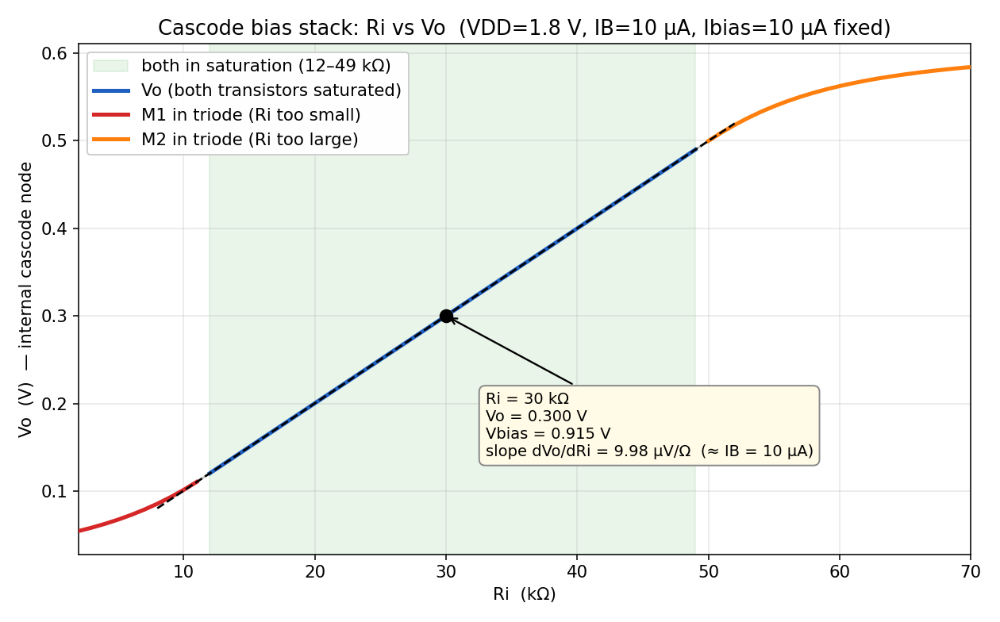

# Cascode Bias Stack — Maximizing Vo Swing with Ri

ngspice simulation of a two-NMOS cascode bias stack. The goal is to choose the
bias resistor **Ri** that maximizes the voltage swing at the internal cascode
node **Vo** while keeping **both** transistors in saturation.

## Circuit

```
M1 vo  vgs vss vss     ; bottom NMOS   (D=vo, G=vgs, S=gnd)
M2 vgs vb  vo  vo      ; cascode NMOS  (D=vgs, G=vb, S=vo)
Ri vb  vgs             ; sets Vbias = vgs + IB*Ri
Ib vcc vb              ; 10 uA pushed into node vb
```

SPICE MOS order is `D G S B`. The devices form a series stack and the current
source feeds the top of the resistor:

```
        IB (10 uA)
         │
        vb ──[ Ri ]── vgs = M1 gate = M2 drain
         │              │
     M2 gate            M2 (D=vgs, S=vo)
                        │
                        vo  ← internal cascode node (the swing node)
                        │
                        M1 (D=vo, S=gnd)
                        │
                       gnd
```

Because there is a single series path and `Ib` is an ideal current source,
**KCL forces the branch current through Ri, M2 and M1 to equal IB = 10 µA for
every value of Ri.** Ri does *not* set the current — it sets

```
Vbias = V(vb) = V(vgs) + IB·Ri
```

and, since the cascode device holds `Vo = Vb − VGS2`, Ri directly positions the
DC level of **Vo**.

### Simulation setup
- `VDD = 1.8 V`, `IB = 10 µA`
- Level-1 NMOS: `VTO=0.5 KP=150u LAMBDA=0.02 GAMMA=0`, `W/L = 5µ/0.5µ`
- `Vth = 0.5 V` exactly (GAMMA=0, and each bulk tied to its own source → VBS=0)
- Overdrive `Vov ≈ 0.115 V` at 10 µA

## The swing window

`Vo` must stay inside the range where both devices remain saturated:

| bound | condition | value |
|-------|-----------|-------|
| lower edge | `Vo ≥ Vov1` (else **M1 → triode**) | ≈ 0.115 V |
| upper edge | `Vo ≤ V(vgs) − Vov2` (else **M2 → triode**) | ≈ 0.500 V |

In terms of Ri this window is **≈ 12 kΩ … 49 kΩ**. Centering `Vo` in the window
maximizes the *symmetric* swing.

## Operating-point comparison (`cascode_bias.cir`)

| Ri | **Vbias** (vb) | vgs | **Vo** | M1 | M2 | swing dn/up | max sym. swing |
|----|------|------|------|------|------|------|------|
| 5 k | 0.682 | 0.632 | 0.068 | **TRIODE** | sat | −0.065 / +0.450 | 0 |
| 10 k | 0.716 | 0.616 | 0.101 | **TRIODE** | sat | −0.015 / +0.400 | 0 |
| 20 k | 0.815 | 0.615 | 0.200 | sat | sat | +0.085 / +0.300 | 0.17 V |
| **30 k** | **0.915** | 0.615 | **0.300** | **sat** | **sat** | **+0.185 / +0.200** | **0.37 V ✅** |
| 40 k | 1.015 | 0.615 | 0.400 | sat | sat | +0.285 / +0.100 | 0.20 V |
| 60 k | 1.215 | 0.615 | 0.562 | sat | **TRIODE** | +0.447 / −0.100 | 0 |

**Ibias = 10 µA in every device, for every Ri.**

## 2-D sweep: Ri vs Vo

Fine sweep (`sweep.cir`, 2 k…70 k in 1 k steps) with the saturation window
shaded and the slope labeled at Ri = 30 kΩ:



The curve is **linear inside the saturation window** with

```
dVo/dRi |_(30k) = 9.98 µV/Ω  ≈  IB = 10 µA
```

which is exactly the expected result: `Vo = V(vgs) + IB·Ri − VGS2`, and both
gate–source drops are pinned by the fixed 10 µA current, so `dVo/dRi = IB`. The
curve bends away from the tangent only once a device enters triode (red = M1
triode at low Ri, orange = M2 triode at high Ri).

## Conclusion

- **Ri ≈ 30 kΩ** centers `Vo` at 0.30 V (window center ≈ 0.31 V) → nearly
  symmetric headroom (+0.185 / +0.200 V) → **maximum symmetric swing ≈ ±0.18 V**
  with both transistors comfortably saturated. Use ~31 kΩ for dead-center.
- **Ri too small** → `Vo` sags, **M1 leaves saturation**.
- **Ri too large** → `Vo` climbs, **M2 leaves saturation**.
- To get *more* than ±0.18 V: raise the top rail `V(vgs)` (larger IB or smaller
  W/L → bigger Vov), or bias M2's gate from a lower-Vov replica so `Vo` can sit
  one Vov above ground (wide-swing cascode).

## Reproduce

```sh
# operating-point comparison table
ngspice -b cascode_bias.cir

# fine sweep -> data -> plot
ngspice -b sweep.cir | grep '^DATA' | awk '{print $2,$3,$4,$5}' > sweep.dat
python3 plot_sweep.py        # writes ri_vs_vo.png
```

Requires `ngspice`, `python3`, `numpy`, `matplotlib`.

## Files
| file | purpose |
|------|---------|
| `cascode_bias.cir` | stepped Ri operating-point comparison |
| `sweep.cir` | fine Ri sweep (2 k…70 k) |
| `sweep.dat` | sweep output: `Ri  Vo  vgs  vb` |
| `plot_sweep.py` | builds `ri_vs_vo.png`, computes slope + window |
| `ri_vs_vo.png` | the 2-D Ri-vs-Vo plot |
